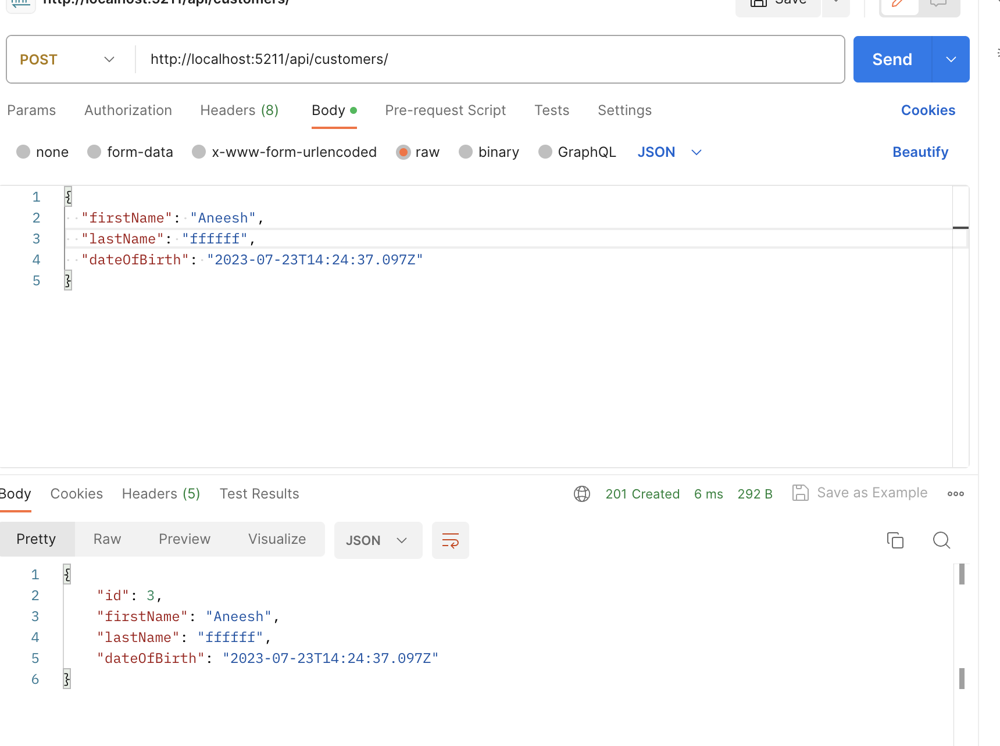
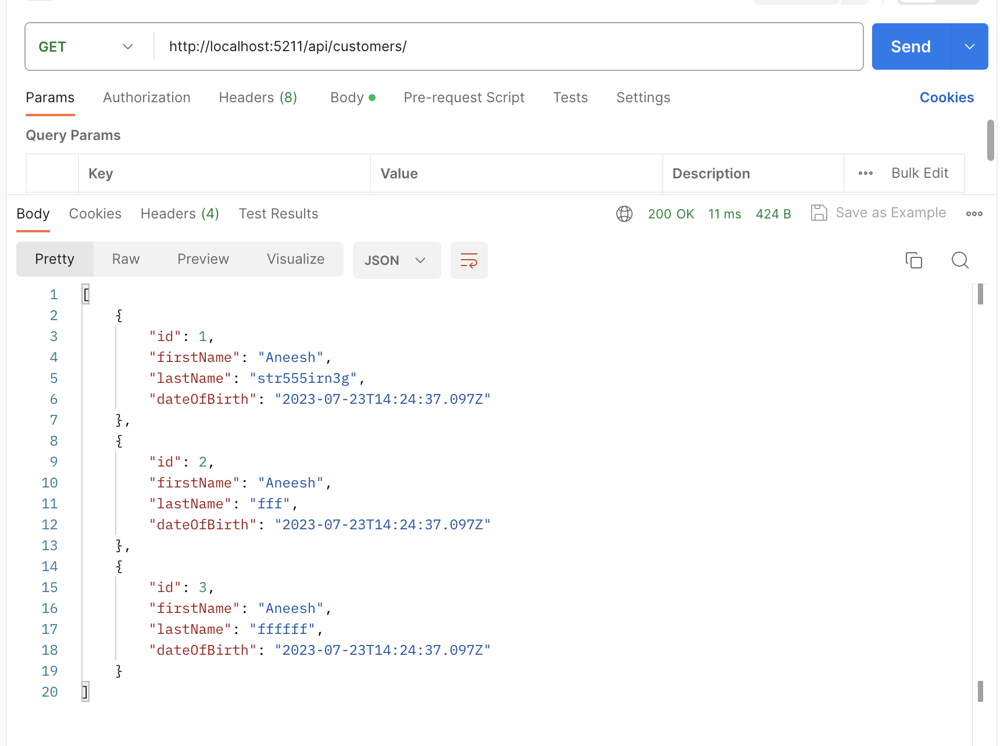
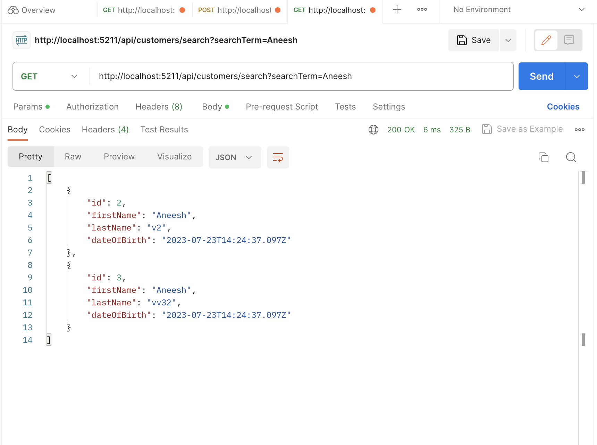
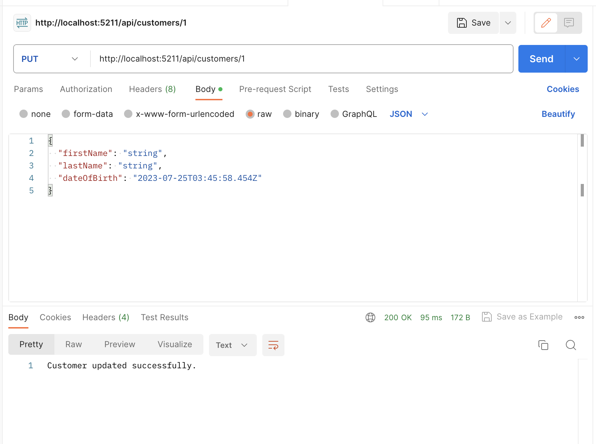
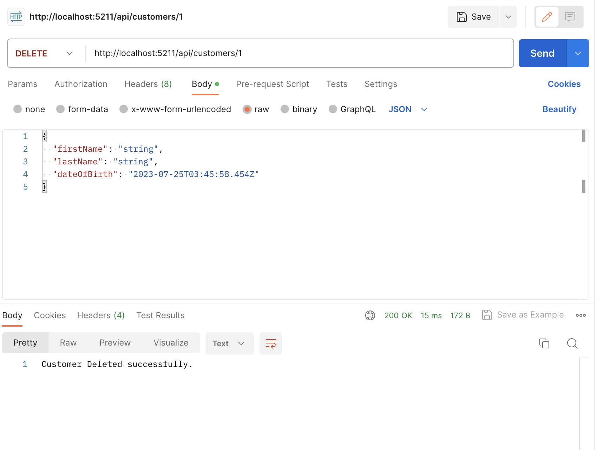
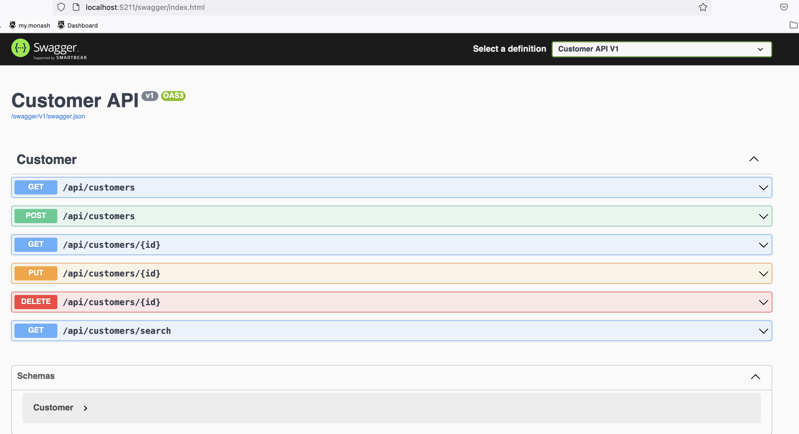

<div align="center" id="top"> 
  

  &#xa0;

  <!-- <a href="https://simpleapi.netlify.app">Demo</a> -->
</div>

<h1 align="center">SimpleApi</h1>

<p align="center">
  

  

  

  

  <!--  -->

  <!--  -->

  <!--  -->
</p>

<!-- Status -->

<!-- <h4 align="center"> 
	🚧  SimpleApi 🚀 Under construction...  🚧
</h4> 

<hr> -->


## :dart: About ##

SImpleAPI is a web application built using ASP.NET Core that provides an API for managing customer data. It allows users to perform CRUD (Create, Read, Update, Delete) operations on customer records. The application uses in memory database currently. (InMemory refers to a type of database that stores data entirely in computer memory (RAM) instead of writing it to disk)

## :sparkles: Features ##

:heavy_check_mark: Adding customers (FirstName, LastName, DOB);\
:heavy_check_mark: Editing customers based on id ;\
:heavy_check_mark: Deleting customers based on id;\
:heavy_check_mark: Searching for a customer by partial name match (first or last name)

## :rocket: Technologies ##

The following tools were used in this project:

- ASP.Net Core 7.0 API (Couldn't find 5.1; says unavailable)
- [C#]
- Swagger / OpenAPI support

## :white_check_mark: Requirements ##


## :checkered_flag: Starting ##

```bash
# Clone this project
$ git clone https://github.com/a9719/simpleapi

# Access
$ cd simpleapi
$ dotnet build
$ dotnet run

# The server will initialize on 


```

## :checkered_flag: Outputs ##

# Add customer


# Get all Customer


# Search customer by either first name or last name


# Updated customer by id 


# Deleted customer by id 


# Swagger Look

